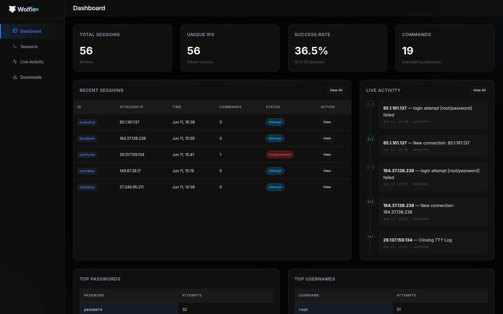
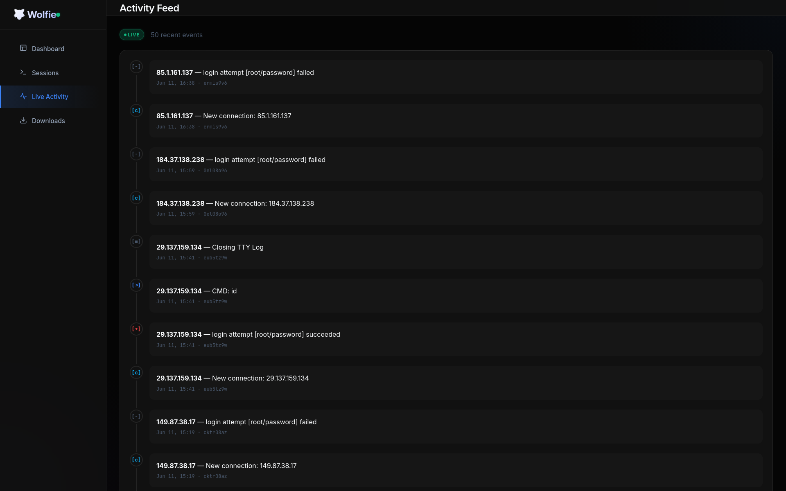
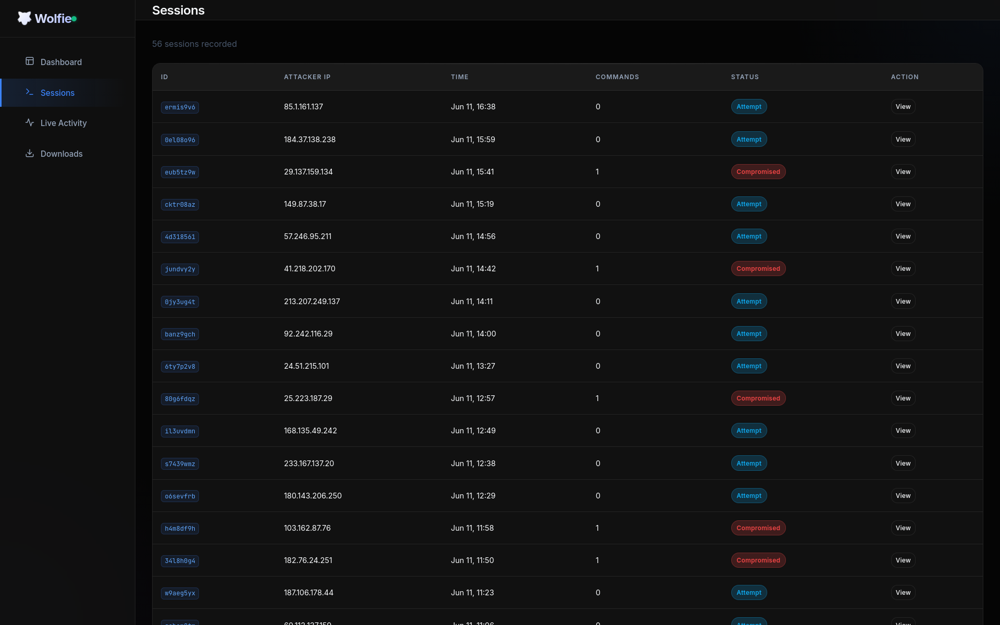
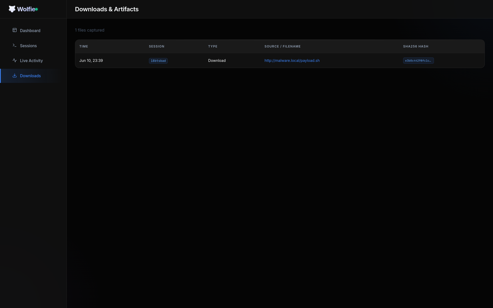

<div align="center">
  
  
  # Wolfie 🐺

  **A lightweight, real-time, zero-dependency monitoring dashboard for Cowrie SSH/Telnet honeypots.**

  <p>
    <a href="#features">Features</a> •
    <a href="#installation--usage">Installation</a> •
    <a href="#architecture">Architecture</a> •
    <a href="#development">Development</a> •
    <a href="#license">License</a>
  </p>
</div>

---

## 🎯 What is Wolfie?

Cowrie is a brilliant honeypot, but its output format (`var/log/cowrie/cowrie.json`) is designed for heavy SIEMs like Splunk, ELK, or Datadog. Setting up an entire ELK stack just to see who's attacking your honeypot is often overkill.

**Wolfie bridges this gap.** It's a pure Vanilla JS frontend coupled with a tiny Python relay server that tails your Cowrie logs in real-time. 

❌ No npm, no Webpack, no React, no databases.  
✅ Just simple, beautiful insights.

## ✨ Features

- 🛠️ **Zero Build Tools**: 100% Vanilla JS, HTML, and CSS.
- 🪶 **Zero Dependencies**: The relay server uses only the Python Standard Library.
- ⚡ **Real-time Streaming**: Uses Server-Sent Events (SSE) to push new attacks to your browser instantly.
- 📁 **Fileless DB**: Reads directly from Cowrie's native NDJSON output.
- 🖥️ **Terminal Replay**: Chronological command timelines reconstructed from event logs.
- 📊 **Rich Insights**: Tracks success rates, top passwords, active sessions, and downloaded malware.
- 📱 **Mobile Responsive**: Works perfectly on phones and tablets.

## 📸 Previews

Here is a glimpse of what Wolfie can do:

| Dashboard | Real-Time Activity |
| :---: | :---: |
|  |  |
| **Sessions Overview** | **Malware Downloads** |
|  |  |

---

## 🚀 Installation & Usage

1. **Clone the repository** (ideally on the same server running Cowrie):
   ```bash
   git clone https://github.com/moemairu/wolfie.git
   cd wolfie
   ```

2. **Start the Relay Server**:
   Point `COWRIE_LOG` to the absolute path of your Cowrie JSON log. By default, it will look for `data/cowrie.json` (demo data).
   
   ```bash
   # Production mode (point to real Cowrie log)
   COWRIE_LOG=/opt/cowrie/var/log/cowrie/cowrie.json python3 server.py
   ```
   
   *Optional Environment Variables:*
   - `WOLFIE_PORT`: Change the port (default 8080)
   - `WOLFIE_HOST`: Change the bind address (default 0.0.0.0)

3. **Access the Dashboard**:
   Open `http://your-server-ip:8080` in your browser.

---

## 🏗️ Architecture

Wolfie relies on a dual-layer architecture:

1. **The Relay Server (`server.py`)**: A tiny, multi-threaded Python HTTP server that:
   - Serves the static HTML/CSS/JS frontend files.
   - Provides REST API endpoints (`/api/events`, `/api/stats`, etc.) by parsing Cowrie's logs on-demand.
   - Maintains an SSE (Server-Sent Events) stream at `/api/events/stream` by tailing the log file and pushing new lines to connected browsers.
2. **The Frontend (`js/`, `css/`)**: A component-based Vanilla JS application that consumes the REST API for initial state and the SSE stream for live updates.

---

## 💻 Development

If you want to modify Wolfie, you don't need any build tools. Simply edit the JS/CSS files and refresh your browser. 

To run with the included demo data:
```bash
python3 server.py
```

---

## 📄 License

MIT License

Copyright (c) 2026 Wolfie Contributors

Permission is hereby granted, free of charge, to any person obtaining a copy
of this software and associated documentation files (the "Software"), to deal
in the Software without restriction, including without limitation the rights
to use, copy, modify, merge, publish, distribute, sublicense, and/or sell
copies of the Software, and to permit persons to whom the Software is
furnished to do so, subject to the following conditions:

The above copyright notice and this permission notice shall be included in all
copies or substantial portions of the Software.

THE SOFTWARE IS PROVIDED "AS IS", WITHOUT WARRANTY OF ANY KIND, EXPRESS OR
IMPLIED, INCLUDING BUT NOT LIMITED TO THE WARRANTIES OF MERCHANTABILITY,
FITNESS FOR A PARTICULAR PURPOSE AND NONINFRINGEMENT. IN NO EVENT SHALL THE
AUTHORS OR COPYRIGHT HOLDERS BE LIABLE FOR ANY CLAIM, DAMAGES OR OTHER
LIABILITY, WHETHER IN AN ACTION OF CONTRACT, TORT OR OTHERWISE, ARISING FROM,
OUT OF OR IN CONNECTION WITH THE SOFTWARE OR THE USE OR OTHER DEALINGS IN THE
SOFTWARE.
